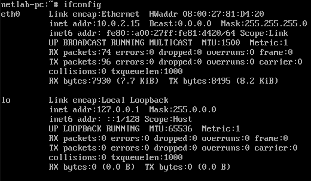
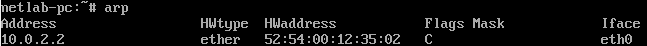

# Лабораторная работа 1.1 Анализ сети.

**Задание 1.**  Выполнить каждую команду, сделать скрин, вставить в отчет, и сопроводить скрин справочной информацией по соответствующей команде. Выполнив эти команды, вы соберете информацию об mac- и ip-адресе, маске сети, маршрутах, dns-серверах, запущенных сетевых службах, просканируете сеть на доступные сетевые службы, адреса доменной зоны.

## `ifconfig`  
  
`ifconfig` (interface configuration) — утилита для настройки и просмотра сетевых интерфейсов.

Что выводит:
* Названия интерфейсов (eth0, wlan0, lo)
* MAC-адреса (HWaddr)
* IP-адреса (inet addr)
* Маски сети (Mask)
* Статистику пакетов (RX/TX)

## `arp`  
  
`arp` (Address Resolution Protocol) — показывает таблицу соответствия IP-адресов MAC-адресам в локальной сети.

Зачем нужно:
* Узнать, какие устройства в сети
* Посмотреть MAC-адреса соседей
* Обнаружить конфликты адресов

route, netstat и команды iproute2: link, addr, route, neigh, ss
iputil: ping, traceroute/tracert и tracepath, iftop, iperf
nslookup или drill или dig, 
wireshark или tcpdump, nmap, whois.
ncat, wget или curl
iptables
